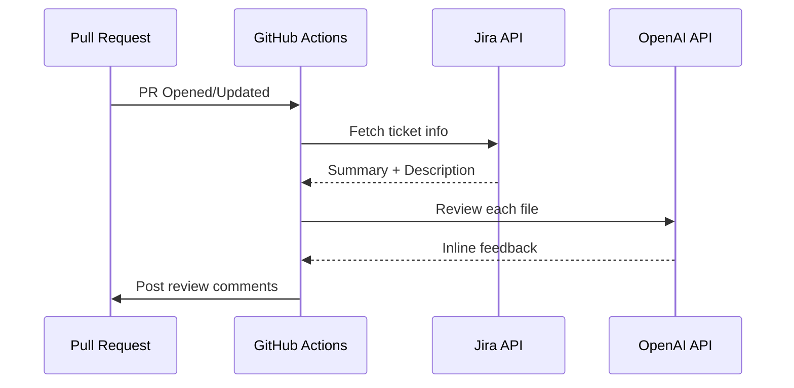

# AI-Powered PR Reviewer 🤖

Otomatik Pull Request inceleme sistemi. GitHub Actions ile entegre çalışır, Jira ticket bilgilerini okur ve OpenAI kullanarak kod incelemesi yapar.

## ✨ Özellikler

- **🔍 Inline Comments**: Değişen satırlara direkt yorum atar
- **🎫 Jira Entegrasyonu**: PR başlığındaki ticket key'inden context çeker
- **⚙️ Yapılandırılabilir**: Model, temperature ve daha fazlası ayarlanabilir
- **📁 Akıllı Filtreleme**: Gereksiz dosyaları (.md, .json, .lock) atlar

## 🚀 Kurulum

### 1. Repository Secrets

GitHub repository'nizde şu secret'ları tanımlayın:

| Secret | Açıklama |
|--------|----------|
| `OPENAI_API_KEY` | OpenAI API anahtarınız |
| `JIRA_EMAIL` | Jira hesap e-postası |
| `JIRA_API_TOKEN` | [Jira API Token](https://id.atlassian.com/manage-profile/security/api-tokens) |
| `JIRA_DOMAIN` | Jira domain'iniz (örn: `yourcompany.atlassian.net`) |

> **Not:** `GITHUB_TOKEN` otomatik olarak sağlanır.

### 2. Dependencies

```bash
npm install
```

### 3. PR Açma

PR başlığına Jira ticket key'ini ekleyin:
```
PROJ-123: Add user authentication feature
```

## ⚙️ Yapılandırma

Workflow dosyasında environment variable'ları override edebilirsiniz:

```yaml
env:
  OPENAI_MODEL: gpt-4o          # Default: gpt-4o-mini
  OPENAI_TEMPERATURE: 0.3       # Default: 0.2
  ENABLE_INLINE: true           # Default: true
  ENABLE_GENERAL: true          # Default: true
  MAX_FILES: 20                 # Default: 15
  IGNORE_EXTENSIONS: .md,.txt   # Default: .md,.txt,.json,.lock
```

## 📁 Proje Yapısı

```
├── .github/workflows/
│   └── pr-review.yml      # GitHub Actions workflow
├── scripts/
│   ├── config.js          # Yapılandırma ayarları
│   └── review.js          # Ana review script
├── package.json
└── README.md
```

## 🔧 Nasıl Çalışır?



## 📝 Örnek Output

PR'da şöyle görünür:

**Genel Yorum:**
> 🤖 **AI PR Review**
> - Overall code quality is good
> - Consider adding error handling in auth module
> - Nice use of TypeScript generics!

**Inline Yorum (satır üzerinde):**
> 🐛 Potential null pointer exception. Add a null check before accessing `user.email`.

## 🤝 Katkıda Bulunma

1. Fork'layın
2. Feature branch oluşturun (`git checkout -b feature/amazing`)
3. Commit'leyin (`git commit -m 'Add amazing feature'`)
4. Push'layın (`git push origin feature/amazing`)
5. Pull Request açın

## 📄 Lisans

MIT